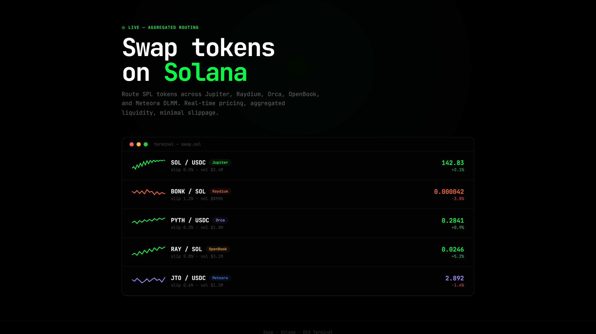
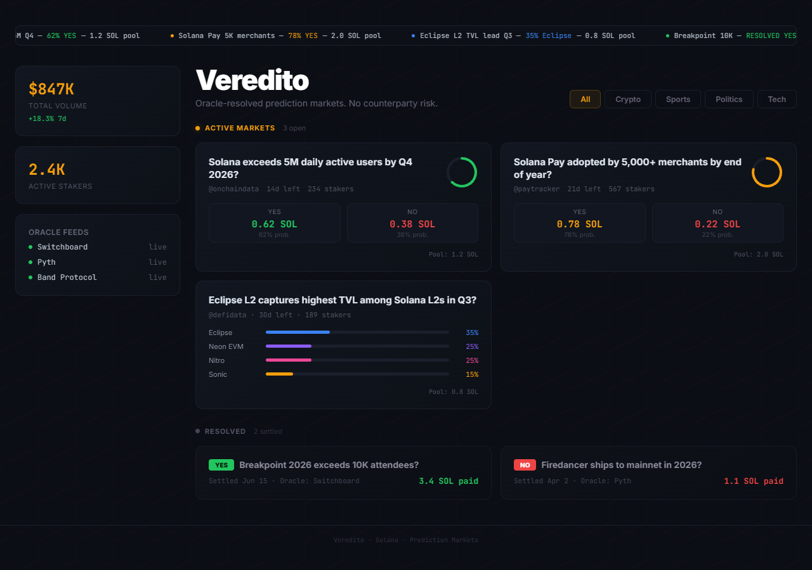
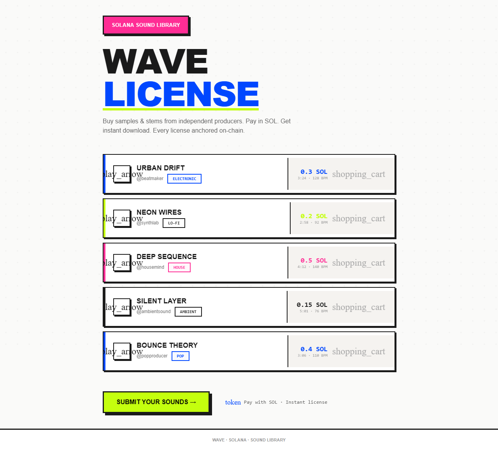
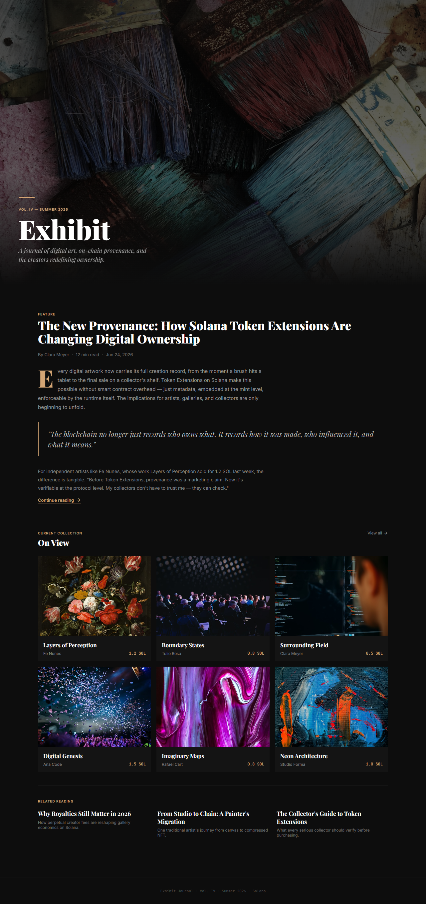
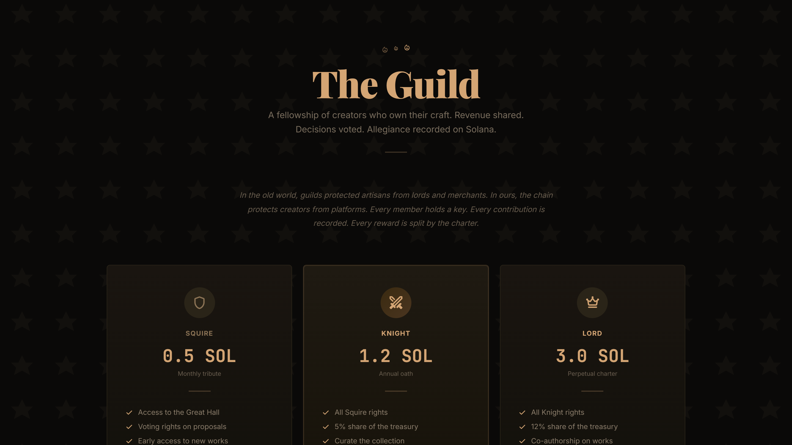

# Solana Digital Media Marketplace Skill

Product design skill for founders building DeFi terminals, prediction markets, music licensing platforms, art magazines, and creator guilds on Solana. Generates premium, production-grade landing pages from compact JSON seeds — five completely distinct aesthetics, zero repetition.

Superteam Brasil Solana AI Kit Skills Bounty.

## Preview

### Swap — DeFi Terminal

Green-on-black monospace terminal with real token coin icons (SOL, BONK, PYTH, RAY, JTO via CoinGecko), live SVG sparkline charts, and gradient pulse background.

### Veredito — Prediction Markets

Clean white cards with probability bars, YES/NO odds panels, category tabs, multi-outcome stacked bars, oracle resolution stamps, and Switchboard/Pyth attribution.

### Wave — Music Licensing

Track list with numbered rows, play buttons, colored genre badges, SOL prices. Canvas wave animation background.

### Exhibit — Editorial Art Magazine

Full-bleed magazine cover with Playfair Display serif, feature article with pull quotes and drop caps, "On View" gallery grid, related reading section. Gold (#d4a574) accent.

### Guild — Medieval Fantasy Membership

Ember fire animations, stone texture background, tier cards (Squire/Knight/Lord), stats banner (members, treasury, commissions).

## Quick start

```bash
git clone https://github.com/superteamBR/solana-digital-asset-marketplace-skill.git
cd solana-digital-asset-marketplace-skill
chmod +x install.sh && ./install.sh
```

## Quick start prompts

Open any example directly:

```bash
open examples/swap.html       # DeFi terminal
open examples/veredito.html    # Prediction markets
open examples/wave.html        # Music platform
open examples/exhibit.html     # Art magazine
open examples/guild.html       # Medieval guild
```

Generate from a seed:

```bash
node examples/generate.js examples/seeds/01-swap.json
```

Pipeline: single prompt or Design.md spec to a working landing page in seconds.

## How the skill works

```
JSON Seed (~30-60 lines)
       |
generate.js (v5.0.0, 5 renderers)
       |
Landing Page HTML (self-contained, opens in any browser)
```

### Seed parameters

These parameters control page generation. Use them in prompts.

| Parameter | Type | Required | Description |
|-----------|------|----------|-------------|
| `slug` | string | yes | URL-safe identifier |
| `name` | string | yes | Project name |
| `tagline` | string | yes | Main statement |
| `layout` | string | yes | swap, veredito, wave, exhibit, or guild |
| `primary` | hex | yes | Primary brand color |
| `accent` | hex | no | Secondary accent color |
| `bg` | hex | yes | Page background color |
| `motion.enabled` | boolean | no | Enable motion graphics |
| `motion.type` | string | no | gradient_pulse, subtle_pulse, waves, parallax, reveal_stagger |
| `icon_style` | string | no | Google Material Icons style |
| `items` | array | yes | Content items (varies by layout) |
| `hero_image` | URL | no | Hero background (exhibit layout) |

### Layout selection guide

| Layout | Best for | Visual style |
|--------|----------|-------------|
| `swap` | DEX, DeFi, trading | Green terminal, CoinGecko icons, sparklines, monospace |
| `veredito` | Prediction, betting, voting | White cards, probability bars, YES/NO odds, categories |
| `wave` | Music, audio, samples | Track list, play buttons, genre tags, canvas waves |
| `exhibit` | Art, editorial, portfolio | Magazine cover, serif, pull quotes, article grid |
| `guild` | Membership, DAO, community | Medieval stone, embers, tier cards, stats banner |

### Keywords for prompts

**Layout**: `swap`, `veredito`, `wave`, `exhibit`, `guild`

**Motion**: `gradient-pulse`, `subtle-pulse`, `waves`, `parallax`, `reveal-stagger`

**Integrations**: `stripe`, `supabase`, `solana-pay`, `crossmint`, `helius`, `metaplex`

**Style**: `dark-terminal`, `clean-market`, `audio-platform`, `editorial-magazine`, `medieval-guild`

### Example prompt

```
Create a DeFi swap page with green-on-black terminal aesthetic,
5 SOL trading pairs with sparkline charts and CoinGecko token icons,
Jupiter routing, gradient pulse motion.
```

Produces a fully rendered `swap.html`.

## Five layouts — zero repetition

### 1. Swap — DeFi Terminal
Real token coin icons from CoinGecko (SOL, BONK, PYTH, RAY, JTO). Terminal window with macOS-style traffic lights. Route badges for Jupiter, Raydium, Orca, OpenBook, Meteora DLMM. Green gradient pulse background.

### 2. Veredito — Prediction Markets
Category tabs at top. YES/NO odds in side panel. Probability bars on each card. Multi-outcome markets with stacked colored bars. Resolved section with YES/NO resolution stamps and oracle attribution (Switchboard, Pyth).

### 3. Wave — Music Licensing
No hero. Just a track list with 01-05 numbering, circular play buttons that fill on hover, genre tags with per-genre colors, SOL prices, BPM, and duration. Canvas wave animation in background.

### 4. Exhibit — Editorial Art Magazine
95vh cover image with gradient overlay. Volume/date masthead. Feature article with serif headline, byline metadata, drop cap paragraph, pull quote, and "Continue reading" link. 6-piece gallery grid. Related reading sidebar.

### 5. Guild — Medieval Fantasy Membership
Pulsing ember fire animations at top. SVG stone texture background. Three tier cards (Squire 0.5 SOL, Knight 1.2 SOL featured, Lord 3.0 SOL) with material icons (shield, swords, crown). Lore paragraph. Stats banner at bottom.

## Integrations

Functional code in `integrations/`:

| File | Service |
|------|---------|
| `supabase.js` | Auth, database schema (assets, licenses, events, predictions), RLS policies |
| `solana-pay.js` | QR codes, on-chain SOL/SPL transfers, payment verification |
| `wallet.js` | Phantom/Backpack/Solflare connect, signMessage, account change listener |
| `api.js` | Serverless API routes for assets, purchases, payment verification |
| `.env.example` | Environment variable template |

## Solana programs referenced

SPL Token, SPL Memo, SPL Account Compression, Solana Pay, Solana Actions and Blinks, Solana Mobile, Metaplex (Token Metadata, Candy Machine).

Official sources only: docs.solana.com, solana.com, solana.foundation, github.com/solana-labs, github.com/solana-foundation, superteamBR.

## Validation

```bash
python3 scripts/validate.py
```

## Why this belongs in Solana AI Kit

Built exclusively on official Solana sources and real network data. References pools (Jupiter, Raydium, Orca, Meteora DLMM), validators (Jito), protocols (Drift, Sanctum Infinity), and network epochs. Integrations documented for Solana Pay, Crossmint, Helius, and Metaplex. Five distinct landing page layouts generated from compact JSON seeds.

## Real utility first

Real utility first. Web2 UX second. Solana proof layer third. Marketplace automation last. Start with a narrow wedge. Keep purchase UX familiar. Use Solana as a silent proof layer for receipts, provenance, and license hashes. Protect file delivery with standard web infrastructure.

## Hackathon use cases

- **DeFi**: Swap terminal with real Solana token icons, sparklines, slippage, route badges
- **Prediction**: Markets with category tabs, YES/NO odds, multi-outcome bars, oracle resolution stamps
- **Music**: Sample licensing with animated wave visualization, genre tags, play buttons
- **Art**: Magazine editorial with full-bleed cover, feature article, pull quotes, gallery grid
- **Membership**: Medieval guild with tier cards, ember animations, treasury stats

Complete demo journey: Landing to action to receipt to verification to admin view.

## Safety notes

- Never expose credentials. Skill includes Secret Vault for key protection.
- Simulate before mainnet. Mainnet Guard blocks unauthorized deploys.
- Verify supply chain. Use npm_supply_chain_guard.py before installing dependencies.
- For Solana program audits, use solanabr/Auditor.

## License

MIT. Built for Superteam Brasil Solana AI Kit Skills Bounty.
